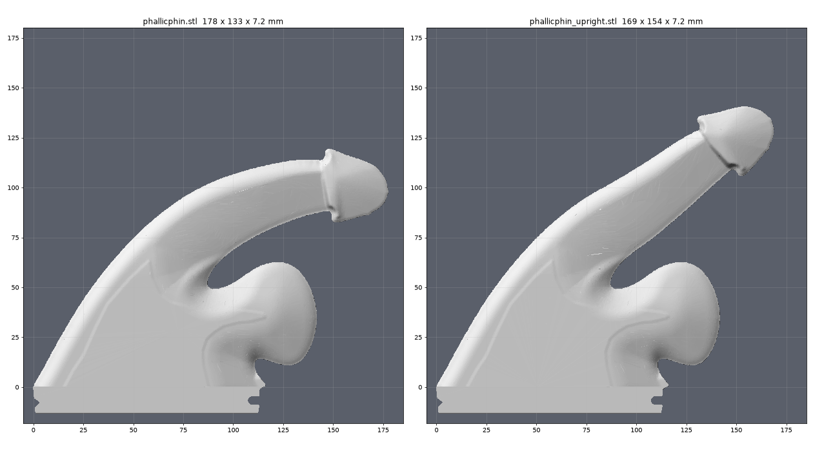
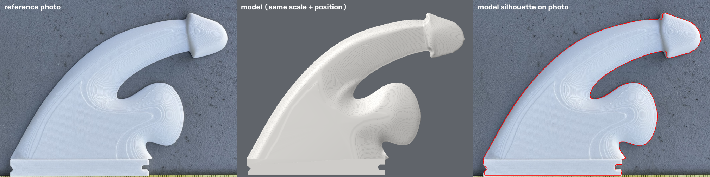
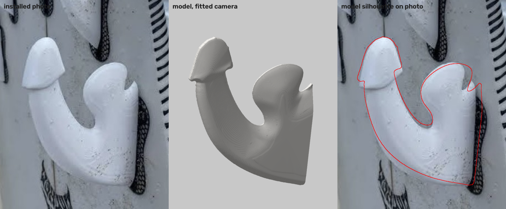
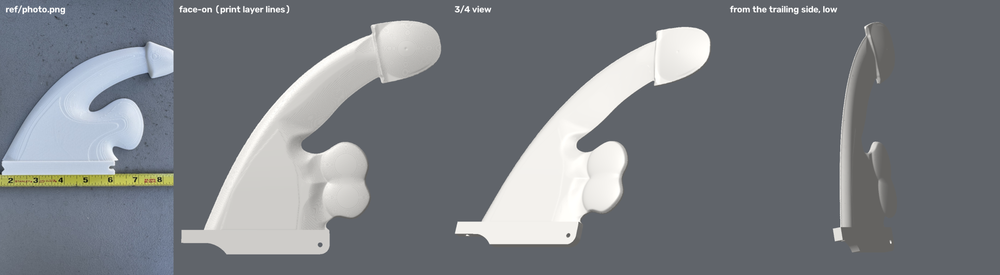
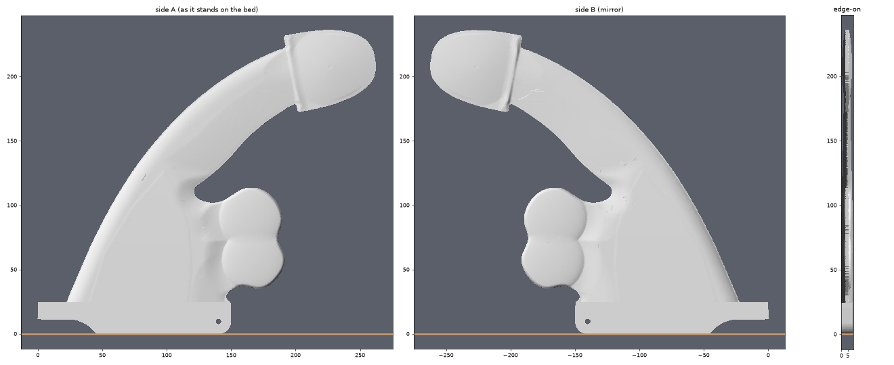

# phallicphin

A novelty surf fin with a standard **Futures** base, traced from photos of a printed original.
Print-ready for a Bambu Lab P2S in PETG. Two templates:

- **rake** (`phallicphin`): as photographed, the shaft and head sweep back.
- **upright** (`phallicphin_upright`): the same fin, but the shaft and head carry on up at the leading edge's angle instead of drooping back.

| file | what |
|--------------------------|-----------------------------------------------|
| `phallicphin.stl` | the fin, 178 x 133 x 7.2 mm, watertight, single body |
| `phallicphin_P2S_PETG.3mf` | Bambu Studio project: P2S, PETG, 0.16 mm, 5 walls, 40% gyroid, no supports (~2h01m, ~53 g) |
| `phallicphin_upright.stl` | upright template, 169 x 154 x 7.2 mm, watertight, single body |
| `phallicphin_upright_P2S_PETG.3mf` | same print settings (~2h01m, ~53 g) |
| `preview.png` | photo / model at the photo's exact scale and position / model silhouette on the photo |
| `preview_installed.png` | installed photo / model from a camera fitted to that photo / model silhouette on it |

## Design

The original is **flat on one side** with all of its relief on the other, and both photos
show that shaped face. `ref/photo_installed.png` is the same face rotated ~90 degrees, with the root
on the right and the lobe's hook notch at top right. It is not the back.
The relief was read off the layer contours visible in `ref/photo.png` (the original was printed
lying flat), and `fin.py` reproduces them:

- **Base:** solid Futures tab, 113 x 13.2 x 7.2 mm, with a front V-notch and a rear set-screw slot (`tab_profile_mm.csv`).
  If it's tight in your box, set `TAB_W = 7.0` in `fin.py` and rebuild.
- **Outline:** traced from the photo at a fixed threshold, with a lower threshold around the head
  so the shaded corona face and the underside of the glans are included. The corners where the shaft meets the flares are filleted (r 1.5 mm), and the flare tips are rounded (r 2 mm).
- **Plateau:** a full-thickness (7.2 mm) area traced from the photo's first layer contour. It is the
  blade triangle with a sharp apex, plus the U-shaped tongue that runs into the lobe. Away from it the
  surface eases off gently over about 9 mm and then falls at a steady slope, so rings nest round the tongue as in the
  photo. Near trailing edges everything is capped by a steeper copy of the edge taper, so edges stay thin; the cap and the fall-off are joined with a smooth min/max (no seams).
- **Leading edge:** a steep 9.4 mm nose up to one layer below the plateau, then a flat terrace, then a
  single 0.2 mm step up onto the triangle.
- **Trailing edges** (shaft-to-lobe gap, lobe, hook): long, nearly straight tapers (34 mm wide at the blade,
  24 mm at the lobe) down to 0.8 mm.
- **Hook tooth** by the rear tab end: at least 2.2 mm thick, for strength.
- **Shaft:** the crest tapers from 7.2 to 5.5 mm between 55 and 95 mm up.
- **Head:** a conical dome (7.2 mm peak) whose rim is 5.6 mm high at the corona and fades to 2.8 mm round the glans.
  It has a 2 mm rounded edge band ending on a 2.4 mm side wall (a solid cap), and only ever falls toward the outline. The corona is a sloped face
  (spread over 1.7 mm) up from the shaft, not a step.
- **Upright template:** `fin.py out.stl upright` builds the rake fin and then warps its fine mesh in XY only.
  - **Spine:** it runs 12.5 mm inside the leading edge, from the root up the shaft and through the head.
  - **Bend:** the rake's leading edge is kept until it reaches about (75, 95), heading about 32 degrees. From there
    the spine holds that heading (`BEND_S` / `BEND_DEG`) instead of drooping over. So the shaft and head carry on
    up and back in a straight line, and the head ends higher and less raked.
  - **What moves:** everything within 20 mm of the spine comes along with it, which is the leading edge, shaft and
    head. The blade and lobe fade back to unmoved by 33 mm. The relief, corona and edges ride along, and the back
    stays flat.
  - **Steeper bends:** `BEND_S` / `BEND_DEG` is a heading table along the spine, so steeper or C-shaped bends are a
    table change. For those, `BACK_FILL = True` adds a fuller, curved back to the shaft (`BACK_RAKE`) with the usual
    trailing-edge taper.
- **Print:** the flat back goes down, with no supports. Layers run the length of the fin, so the root
  is solid plateau the full tab thickness (strong where it matters).

## Longboard

A re-imagined 9" longboard single fin on a **US box** base (`boxbase.py`: 149.6 x 24.5 x 8.63 mm tab,
3/16" pin hole, set-screw plate slot, measured from a stock longboard fin). Same character (balls with
the gap notch at the root, swept shaft, head with corona rim and dome at the tip), proportioned to fill
the P2S bed. `make_3mf.py` rotates parts that don't fit the 250 mm square straight.

| file | what |
|---|---|
| `phallicphin_longboard.stl` | flat-backed, 262 x 236 x 8.6 mm; prints flat, rotated 4 deg (~4h30m, ~117 g) |
| `phallicphin_longboard_upright.stl` | double-sided foil centered on the tab (`--sym`), stands on the tab; same outline, relief split across both faces |
| `phallicphin_longboard_upright_P2S_PETG.3mf` | upright print: 12 mm brim, tree supports (`print_fin_upright.json`), 45 deg on the plate (~6h55m, ~158 g) |

## Rebuild

    python3 -m venv .venv
    .venv/bin/pip install trimesh manifold3d numpy scipy shapely scikit-image opencv-python-headless networkx matplotlib

    .venv/bin/python trace_outline.py ref/photo.png outline_mm.csv      # photo -> outline (scale: tab = 113 mm)
    .venv/bin/python fin.py phallicphin.stl                              # params at the top of fin.py
    .venv/bin/python make_3mf.py phallicphin.stl template_P2S_PETG.3mf phallicphin_P2S_PETG.3mf print_fin.json
    .venv/bin/python fin.py phallicphin_upright.stl upright
    .venv/bin/python make_3mf.py phallicphin_upright.stl template_P2S_PETG.3mf phallicphin_upright_P2S_PETG.3mf print_fin.json
    .venv/bin/python render_variants.py preview_variants.png phallicphin.stl phallicphin_upright.stl
    .venv/bin/python render_preview.py phallicphin.stl ref/photo.png preview.png ref/photo_installed.png preview_installed.png

    .venv/bin/python longboard.py phallicphin_longboard.stl
    .venv/bin/python make_3mf.py phallicphin_longboard.stl template_P2S_PETG.3mf phallicphin_longboard_P2S_PETG.3mf print_fin.json
    .venv/bin/python longboard.py phallicphin_longboard_upright.stl --sym
    .venv/bin/python make_3mf.py phallicphin_longboard_upright.stl template_P2S_PETG.3mf phallicphin_longboard_upright_P2S_PETG.3mf print_fin_upright.json
